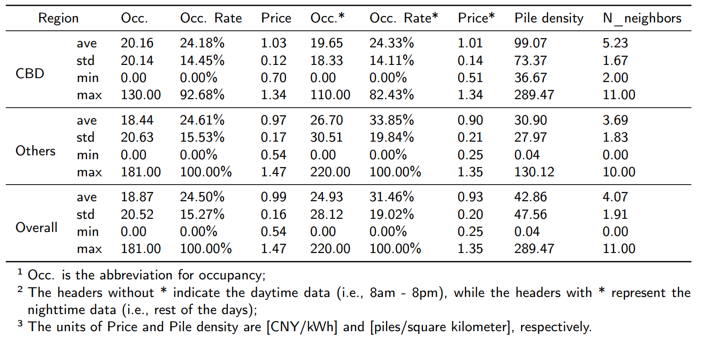
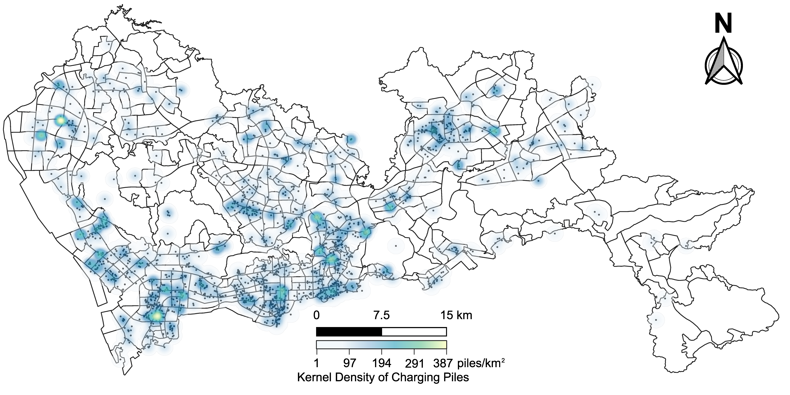

## Spatio-temporal EVCDP (Shenzhen) Datasets
This project is dedicated to offering high-quality, real-world, open datasets for researching spatio-temporal electric vehicle (EV) charging demand in urban areas. We have publicly released two well-structured datasets:
1. **ST-EVCDP** (available in this repository): This dataset includes information on 18,061 public charging piles, covering a period of 30 days with data recorded at a minimum interval of 5 minutes.
2. **UrbanEV** (accessible at [GitHub - IntelligentSystemsLab/UrbanEV](https://github.com/IntelligentSystemsLab/UrbanEV)): This dataset comprises data from 24,798 public charging piles over six months, with data intervals of both 5 minutes and 1 hour.

## Updates
* March 28, 2025: Our dataset paper, *UrbanEV: An Open Benchmark Dataset for Urban Electric Vehicle Charging Demand Prediction*, has been published online at [Scientific Data](https://www.nature.com/articles/s41597-025-04874-4)!
* **Feb. 13, 2025: An updated ST-EVCDP-v2 is released at [UrbanEV](https://github.com/IntelligentSystemsLab/UrbanEV), which includes many detailed and processed charging data with a long time span of six months.**
* Nov. 23, 2024: Update 'occupancy.csv', 'duration.csv', 'volume.csv', 'e_price.csv', and 's_price.csv' in ST-EVCDP-v2.
* **Oct. 24, 2024: We have recently endeavored to forecast EV charging demand utilizing LLMs, i.e., ChatEV. The paper is now available at [TRD](https://www.sciencedirect.com/science/article/abs/pii/S1361920924004279?CMX_ID=&SIS_ID=&dgcid=STMJ_219742_AUTH_SERV_PA&utm_acid=285873158&utm_campaign=STMJ_219742_AUTH_SERV_PA&utm_in=DM517501&utm_medium=email&utm_source=AC), with the code at [Github-ChatEV](https://github.com/Quhaoh233/ChatEV).**
* **Sep. 26, 2024: Our data analysis paper, which explores the relationship between price changes and demand, is now accessible at [Sustainable Cities and Society](https://www.sciencedirect.com/science/article/pii/S2210670724006607?casa_token=iZXxEsQ6voEAAAAA:D5MgoyJf3LNAHF_VKKiwFBG51CeKOE86SY974d0Sj_RLy6_o0D093PecRoWPO_rA8h5Tc85y8A).**
* July 11, 2024: Update 'duration.csv' in ST-EVCDP-v2.
* July 8, 2024: We uploaded meteorological data collected from two weather stations for ST-EVCDP-v2, see link below.
* **July 2, 2024: We are excited to announce the release of the early access version of ST-EVCDP-v2! You can download the data from [Google Drive Link](https://drive.google.com/drive/folders/1sqOUEpMh8VMiJhrT-MOn5OsB1-KirUVq?usp=drive_link).**
* May 30, 2024: The ST-EVCDP-V2 dataset is still being compiled... We will make every effort to release it as quickly as we can.
* May 14, 2024:  Our paper has been accepted by [IEEE T-ITS](https://ieeexplore.ieee.org/document/10539613)!
* ST-EVCDP-Version2 is coming soon. The data will span from September 2022 to September 2023, with granularity to charging stations, including coordinates, numbers of chargers, occupancy, and price. Other information will also be gradually released after being desensitized for academic research purposes.
* May 12, 2024: We uploaded the data of weather conditions in the studied areas, namely `SZweather20220619-20220718.csv` and `SZweather_Header.txt`.
* March 15, 2024: We uploaded the data of charging duration and volume in the studied areas.

## Data Description

### ST-EVCDP
The data used in this study is drawn from a publicly available mobile application, which provides the real-time availability of charging piles (i.e., idle or not). Within **Shenzhen**, China, a total of 18,061 public charging piles are covered during the studied period from 19 June to 18 July 2022 (30 days) with a minimum interval of 5 minutes and `8640 timestamps`. As shown in Figure 1, the city is constructed into a graph-structure data with `247 nodes` (traffic zones) and `1006 edges` (adjacent relationships).

 Figure 1. Spatial distribution of the 18,061 public EV charging piles in ST-EVCDP.

Besides, the pricing schemes for the studied charging piles are also collected. Among the 247 traffic zones, 57 of them (enclosed in red lines) deploy time-based pricing schemes, while others use fixed ones. More statistical details are illustrated in the following table.



### UrbanEV (i.e., ST-EVCDP-v2)
Expanding on the foundation of ST-EVCDP, we have gathered an extensive dataset called UrbanEV, specifically tailored for EV-related research. This dataset covers a timeframe of **six month**, spanning from September 2022 to Feburary 2023, which includes comprehensive information such as coordinates, charging occupancy, duration, volume, and price for a total of 1,682 public charging stations with 24,798 public charging piles. Notably, it provides detailed information on charging stations, with a granularity that allows analysis at the charging station level. And its temporal interval is one hour. The dataset is available at the github repo: [UrbanEV](https://github.com/IntelligentSystemsLab/UrbanEV) and the Dryad repo: [Dryad-UrbanEV](https://datadryad.org/dataset/doi:10.5061/dryad.np5hqc04z).

 Figure 2. Spatial distribution of the 24,798 public EV charging piles in UrbanEV.

## Files
### ST-EVCDP
* `adj.csv`: The adjacent matrix of studied areas, 1 indicates the two traffic zones are neighboring, vice versa.
* `distance.csv`: Distances between nodes.
* `information.csv`: Several basis information about the data, including pile capacity, longitude, latitude, whether or not located in the central business district (1:yes, 0:no), and whether or not on a time-based pricing scheme (1:yes, 0:no).
* `occupancy.csv`: The real-time EV charging occupancy in studied areas.
* `duration.csv`: The real-time EV charging duration in studied areas, i.e., the sum of charging time for all charging piles, unit in hour.
* `volume.csv`: The real-time EV charging volume in studied areas, i.e., the total power consumption of all charging piles, unit in kWh.
* `price.csv`: The real-time EV charging pricing in studied areas.
* `time.csv`: The timestamps of studied period.
* `Shenzhen.qgz`: The QGIS map file of Shenzhen city.

### UrbanEV/ST-EVCDP-v2
* `inf.csv`: Important information of the charging stations, including coordinates and charging capacities.
* `occupancy.csv`: Hourly EV charging occupancy (busy count) in certain stations.
* `duration.csv`: Hourly EV charging duration in specific stations (Unit: hour).
* `volume.csv`: Hourly EV charging volume in specific stations (Unit: kWh).
* `e_price.csv`: Electricity price for specific stations (Unit: Yuan/kWh).
* `s_price.csv`: Service price for specific stations (Unit: Yuan/kWh).
* `weather_airport.csv`: Weather data collected from the meteorological station at Bao'an Airport (Shenzhen).
* `weather_central.csv`: Weather data collected from Futian Meteorological Station located in the city centre area of Shenzhen.
* `weather_header.csv`: Descriptions of the table headers presented in `weather_airport.csv` and `weather_central.csv`.

## Enviroment Requirement
```shell
pip install -r requirements.txt
```

## An simple example to run Spatio-temporal Prediction on the dataset

We developed a physics-informed and attention-based approach for spatio-temporal EV charging demand prediction, named **PAG**. Expect that, some representative methods are included, e.g., LSTM, and GCN-LSTM, GAT-LSTM. You can train and test the proposed model through the following procedures:

1. Choose your model in line 45 of `main.py` or use the default model (PAG) by skipping this procedure.
2. Run `main.py` via Pycharm, etc. or change your ROOT_PATH and command:

```shell
cd [path] && python main.py
```

## Extend:
* If you want to run your own models on the datasets we offer, you should go to `models.py` and replace the model in `main.py`.
* We have also released a simple repository for a **Large Language Model**-based electric vehicle charging demand predictor, available at [ChatEV](https://github.com/Quhaoh233/ChatEV).

## Citations:
 If this project is helpful to your research, please cite our papers:

>Qu, H., Kuang, H., Li, J., & You, L. (2023). A physics-informed and attention-based graph learning approach for regional electric vehicle charging demand prediction. IEEE Transactions on Intellgent Transportation Systems. [Paper in IEEE Explore](https://ieeexplore.ieee.org/document/10539613) [Paper in arXiv](https://arxiv.org/abs/2309.05259)

>Kuang, H., Zhang, X., Qu, H., and You, L., and Zhu, R. and Li, J. (2024). Unravelling the effect of electricity price on electric vehicle charging behavior: A case study in Shenzhen, China. Sustainable Cities and Society. [DOI](https://doi.org/10.1016/j.scs.2024.105836)

>Haohao Qu, Han Li, Linlin You, Rui Zhu, Jinyue Yan, Paolo Santi, Carlo Ratti, Chau Yuen. (2024) ChatEV: Predicting electric vehicle charging demand as natural language processing. Transportation Research Part D: Transport and Environment. [Paper in TRD](https://doi.org/10.1016/j.trd.2024.104470) [Code in Github](https://github.com/Quhaoh233/ChatEV)

>Li, H., Qu, H., Tan, X. et al. (2025) UrbanEV: An Open Benchmark Dataset for Urban Electric Vehicle Charging Demand Prediction. Scientific Data. [Paper in Spring Nature](https://doi.org/10.1038/s41597-025-04874-4)

```shell
@Article{qu2024a,
  author={Qu, Haohao and Kuang, Haoxuan and Wang, Qiuxuan and Li, Jun and You, Linlin},
  journal={IEEE Transactions on Intelligent Transportation Systems}, 
  title={A Physics-Informed and Attention-Based Graph Learning Approach for Regional Electric Vehicle Charging Demand Prediction}, 
  year={2024},
  pages={1-14},
  doi={10.1109/TITS.2024.3401850}}

@article{kuang2024unravelling,
  title={Unravelling the effect of electricity price on electric vehicle charging behavior: A case study in Shenzhen, China},
  author={Kuang, Haoxuan and Zhang, Xinyu and Qu, Haohao and You, Linlin and Zhu, Rui and Li, Jun},
  journal={Sustainable Cities and Society},
  pages={105836},
  year={2024},
  publisher={Elsevier}
}

@article{qu2024chatev,
 title = {ChatEV: Predicting electric vehicle charging demand as natural language processing},
 journal = {Transportation Research Part D: Transport and Environment},
 volume = {136},
 pages = {104470},
 year = {2024},
 issn = {1361-9209},
 author = {Haohao Qu and Han Li and Linlin You and Rui Zhu and Jinyue Yan and Paolo Santi and Carlo Ratti and Chau Yuen},
}

@article{li2025urbanev,
 title = {UrbanEV: An Open Benchmark Dataset for Urban Electric Vehicle Charging Demand Prediction},
 journal = {Scientific Data},
 volume = {12},
 pages = {523},
 year = {2025},
 issn = {2052-4463},
 author = {Li, Han and Qu, Haohao and Tan, Xiaojun and You, Linlin and Zhu, Rui and Fan, Wenqi},
}
```

Author: Haohao Qu (haohao.qu@connect.polyu.hk)
